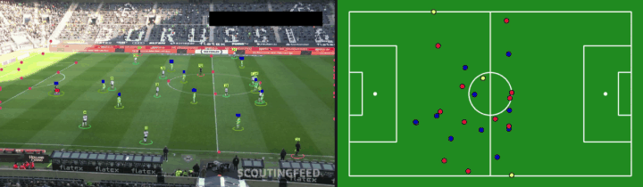
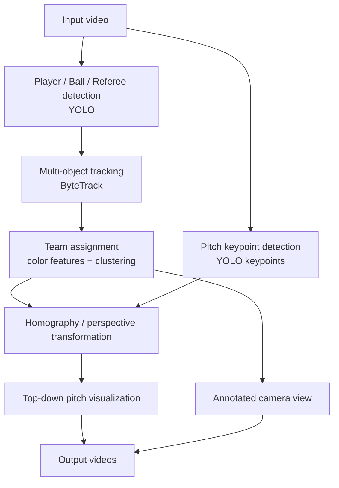

<h1 align="center">⚽ Football Video Analysis</h1>

<p align="center">
  Detection, tracking, team assignment, and top-down pitch mapping for football (soccer) broadcast video.
</p>

<p align="center">
  
  
  
  
  
  
</p>

<p align="center">
  
  <br>
  <em>Left: annotated broadcast footage. Right: players, referees and ball mapped onto a 2D pitch.</em>
</p>

<!-- Optional: full-quality video.
     Edit this README on github.com and drag-drop demo.mp4 into the editor;
     GitHub inserts a https://github.com/user-attachments/... link that plays inline.
     Paste that link on its own line here. -->

The project takes a football video as input, detects and tracks players, referees, goalkeepers, and the ball, identifies each player's team, detects pitch landmarks, and maps everything from the camera view to a 2D football-pitch coordinate system.

## Table of Contents

- [Quick Start](#quick-start)
- [Pipeline](#pipeline)
- [Features](#features)
- [Project Structure](#project-structure)
- [Installation](#installation)
- [Model Weights](#model-weights)
- [Dataset](#dataset)
- [Configuration](#configuration)
- [Usage](#usage)
- [Creating a Demo GIF / Video](#creating-a-demo-gif--video)
- [Main Components](#main-components)
- [Model Training](#model-training)
- [Output](#output)
- [Current Limitations](#current-limitations)
- [Roadmap](#roadmap)
- [Technologies](#technologies)
- [License](#license)

## Quick Start

```bash
git clone https://github.com/ma-nazari83/Football-Analysis.git
cd Football-Analysis
pip install -r requirements.txt

# 1. download the two model weights into models/  (see "Model Weights")
# 2. put a football video at datasets/simple.mp4
python main.py
```

## Pipeline



## Features

- Player, goalkeeper, referee, and ball detection using YOLO
- Multi-object tracking with ByteTrack
- Team assignment from visual/color features and clustering
- Football-pitch keypoint detection
- Mapping from broadcast-camera coordinates to real pitch coordinates
- Top-down 2D pitch visualization
- Annotated output video generation
- Notebooks for training the object detector and the pitch-keypoint detector
- `make_demo.py` to turn results into a README-ready GIF / MP4

## Project Structure

```
Football-Analysis/
├── main.py
├── config.py
├── make_demo.py            # builds assets/demo.gif and demo.mp4 from outputs/
├── requirements.txt
│
├── tracking/
│   ├── __init__.py
│   └── tracker.py
│
├── team_assignment/
│   ├── __init__.py
│   └── team_assigner.py
│
├── transformation/
│   ├── __init__.py
│   ├── football_coords.py
│   └── transformer.py
│
├── visualization/
│   ├── __init__.py
│   └── p_renderer.py
│
├── utils/
│   ├── __init__.py
│   └── video_utils.py
│
├── notebooks/
│   ├── model_training_players.ipynb
│   └── model_training_field.ipynb
│
├── assets/                 # demo.gif, preview.png (tracked)
├── datasets/               # not tracked by Git
├── models/                 # not tracked by Git
└── outputs/                # generated results (not tracked)
```

> `datasets/`, `models/` and `outputs/` are intentionally excluded from Git because videos and model weights are large.

## Installation

Requires Python 3.10+.

```bash
git clone https://github.com/ma-nazari83/Football-Analysis.git
cd Football-Analysis

python3 -m venv .venv
source .venv/bin/activate        # Windows: .venv\Scripts\activate

python -m pip install --upgrade pip
pip install -r requirements.txt
```

Main dependencies: PyTorch, Ultralytics, Supervision, OpenCV, NumPy, scikit-learn. The exact list is in `requirements.txt`.

## Model Weights

Place the trained weights inside `models/`:

```
models/
├── yolo-football-player-detection.pt
└── yolo-football-pitch-detection.pt
```

| Model | Purpose | Download |
| ----- | ------- | -------- |
| Player / object detector | players, referees, goalkeepers, ball | [Hugging Face](https://huggingface.co/martinjolif/yolo-football-player-detection/blob/main/yolo-football-player-detection.pt) |
| Pitch keypoint detector | pitch landmarks for the perspective transform | [Hugging Face](https://huggingface.co/martinjolif/yolo-football-pitch-detection) |

Weights are not stored in this repository because of their size.

## Dataset

Place input videos in `datasets/`, for example `datasets/simple.mp4`.

Training data for the YOLO models is available on Roboflow:

- [Football players detection](https://universe.roboflow.com/roboflow-jvuqo/football-players-detection-3zvbc)
- [Football field detection](https://universe.roboflow.com/roboflow-jvuqo/football-field-detection-f07vi)

Large datasets and videos should not be committed to Git.

## Configuration

Paths are defined relative to the repository root in `config.py`:

```python
from pathlib import Path

PROJECT_ROOT = Path(__file__).resolve().parent

DATASET_DIR = PROJECT_ROOT / "datasets"
MODEL_DIR = PROJECT_ROOT / "models"
OUTPUT_DIR = PROJECT_ROOT / "outputs"

PLAYER_MODEL_PATH = MODEL_DIR / "yolo-football-player-detection.pt"
PITCH_MODEL_PATH = MODEL_DIR / "yolo-football-pitch-detection.pt"

DEFAULT_VIDEO_PATH = DATASET_DIR / "simple.mp4"
```

Relative paths keep the project portable across machines.

## Usage

```bash
python main.py
```

For each frame the pipeline:

1. Detects football-related objects.
2. Updates object tracks with ByteTrack.
3. Extracts detected players.
4. Assigns players to teams.
5. Detects pitch keypoints.
6. Estimates the transformation between image and pitch coordinates.
7. Transforms object positions to the top-down pitch.
8. Draws annotations on the original frame.
9. Draws players, referees, and the ball on the 2D pitch.
10. Saves the generated videos to `outputs/`.

## Creating a Demo GIF / Video

After running `main.py`, turn the results into a short clip for this README:

```bash
# camera view + top-down pitch, side by side (8 s starting at 10 s)
python make_demo.py --annotated outputs/annotated.mp4 --pitch outputs/pitch.mp4 --start 10 --duration 8
```

(Use the file names your `main.py` writes to `outputs/`.)

This creates `assets/demo.gif` (autoplays in the README), `assets/demo.mp4` (H.264), and `assets/preview.png`. Add `--gif-width 560 --gif-fps 8` if the GIF is over 10 MB.

> **Note:** if you use broadcast footage, make sure you have the right to share it. Short clips, your own footage, or freely licensed match videos are safest.

## Main Components

### Object Detection and Tracking

`tracking/tracker.py`

Loads the football object-detection model, converts Ultralytics detections into Supervision detections, and uses ByteTrack to preserve object identities across frames. Produces bounding boxes, confidence scores, object classes, tracker IDs, and cropped object images.

### Team Assignment

`team_assignment/team_assigner.py`

Separates players into two teams from visual information in their image crops, using clustering. This keeps team membership consistent in both the camera view and the top-down view.

### Pitch Detection

`transformation/transformer.py`

A keypoint-detection YOLO model finds known landmarks on the pitch. Only sufficiently confident keypoints are kept for the perspective transformation.

### Pitch Coordinate System

`transformation/football_coords.py`

Defines the pitch geometry and landmark coordinates used as reference points when converting image coordinates to pitch coordinates.

### Visualization

`visualization/p_renderer.py`

Draws players, referees, goalkeepers, the ball, and the pitch geometry on a top-down view.

### Video Utilities

`utils/video_utils.py`

Helper functions for reading and saving video.

## Model Training

| Notebook | Purpose |
| -------- | ------- |
| `notebooks/model_training_players.ipynb` | Train and evaluate the player/object detector |
| `notebooks/model_training_field.ipynb` | Train and evaluate the pitch-keypoint detector |

Training runs, checkpoints, and large artifacts should be kept out of Git.

## Output

- **Annotated camera view:** the original video with tracked objects, IDs, pitch keypoints, and class/team labels.
- **Top-down pitch view:** a 2D pitch showing transformed player, referee, goalkeeper, and ball positions.

## Current Limitations

- Team assignment relies on color/appearance and can degrade with strong lighting changes or similar kits.
- The pitch transformation needs enough reliable pitch keypoints in view.
- Occlusion, motion blur, and unusual camera angles reduce detection and tracking quality.
- Designed for broadcast-style footage; other camera setups may need adaptation.

## Roadmap

- [ ] More robust team classification across a full match
- [ ] Player re-identification
- [ ] Trajectory and heatmap visualization
- [ ] Player speed and distance estimation
- [ ] Possession estimation
- [ ] Automatic event detection
- [ ] Better ball tracking during occlusion
- [ ] Tactical formation analysis
- [ ] Camera-motion-aware tracking
- [ ] Export tracking and pitch coordinates to CSV / JSON
- [x] Demo GIF in this README

## Technologies

Python · PyTorch · Ultralytics YOLO · Supervision · ByteTrack · OpenCV · NumPy · scikit-learn · Jupyter Notebook

## License

Distributed under the MIT License. See `LICENSE` for details.

---

Contributions and suggestions are welcome, feel free to open an issue.
